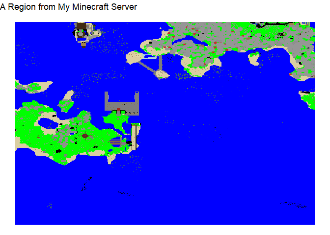
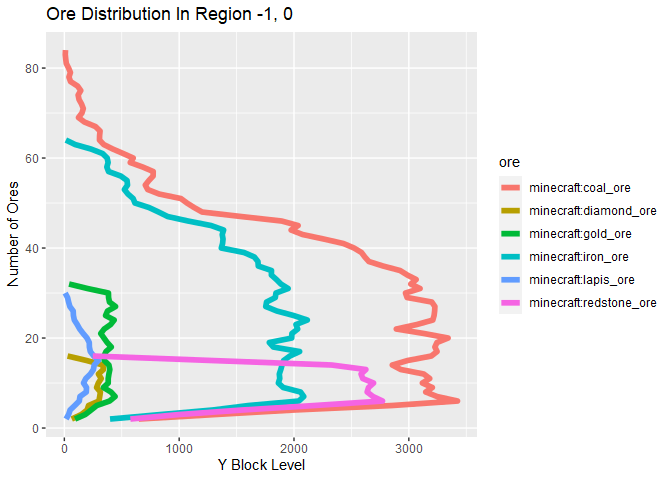

## About

This is an R package for plotting Minecraft worlds (stored in “Anvil”
format).

It can also load block data into a data.frame for analysis, and parse
NBT files.

## Installation

The package can be installed by running the following R code. This
assumes the `devtools` package has already been installed. If not,
uncomment the first line.

``` r
#install.packages("devtools)
devtools::install_github("hrbrmstr/gzmem")
devtools::install_github("jackvanschaik/gganvil")
```

The `gzmem` package is needed for in-memory zlib decompression.

The package can then be loaded via

``` r
library(gganvil)
```

## Examples

#### Locate the region of interest

This package currently processes a single world region at a time. A
region contains a 32 by 32 grid of chunks, where each chunk contains 16
by 16 by (height) number of blocks. So each region covers a 512 by 512
block region.

There’s a helper function called `get_region_name` to get the region
file name if you know the X and Z coordinate of the chunk of interest.
This can be found in game by pressing F3.

``` r
library(gganvil)
library(ggplot2)
```

    ## Warning: package 'ggplot2' was built under R version 4.0.4

``` r
library(dplyr)
```

    ## 
    ## Attaching package: 'dplyr'

    ## The following objects are masked from 'package:stats':
    ## 
    ##     filter, lag

    ## The following objects are masked from 'package:base':
    ## 
    ##     intersect, setdiff, setequal, union

``` r
library(reshape2)

region_file <- get_region_name(-8, 10)
file_path <- paste0("C:/Users/Jack/Documents/mc_server/world/region/", region_file)
file_path
```

    ## [1] "C:/Users/Jack/Documents/mc_server/world/region/r.-1.0.mca"

#### Get the top block and plot them

The function `region_top_block` function will process a region file, and
get the top block at each coordinate, producing a 512 by 512 character
matrix of block names.

The `plot_top_blocks` functions plots the matrix with `ggplot2`. A
custom built map is used to

``` r
top_blocks <- region_top_block(file_path)
plot_top_blocks(top_blocks) + labs(title = "A Region from My Minecraft Server")
```

<!-- -->

#### Do Some Data Analysis

We can also get all the block data as a melted data.frame, so we can use
familiar R tools to do block-level data analysis. The `region_data`
function is the workhorse for this, it uses a region file path as input.

For me, this data.frame has nearly 20 million rows, so be warned.

``` r
my_region_data <- region_data(file_path)
```

``` r
library(stringr)

my_region_data %>%
    count(block) %>%
    filter(str_detect(block, "_ore")) %>%
    pull(block) ->
    ores

my_region_data %>% 
    filter(block %in% ores) %>%
    transmute(
        y = y,
        ore = block
    ) %>%
    group_by(y, ore) %>%
    summarise(count = length(ore)) %>%
    ungroup ->
    ore_data
```

    ## `summarise()` regrouping output by 'y' (override with `.groups` argument)

``` r
ggplot(ore_data, aes(x = y, y = count, group=ore, color=ore)) + 
    geom_line(size=2) + coord_flip() +
    labs(title = "Ore Distribution In Region -1, 0", y = "Y Block Level", 
         x = "Number of Ores")
```

<!-- -->
